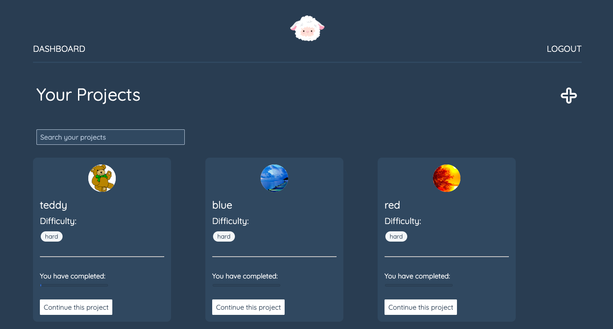

# Software Engineneering Immersive: Project 4 (Individual)
This is my final project I built during the General Assembly Software Engineering Immersive course (Week 12).

# Yarn

A full-stack React and Python web app that helps user transform an image into an interactive embroidery grid.

## Built With

1. HTML5
2. SCSS & Spectre
3. Javascript
   * ECMAScript6
   * React.js
4. Python
   * Flask
5. mySQL
   * PostgreSQL
6. GitHub

## Deployment

This web app is deployed on Heroku and it can be found here: https://yarn-embroidery.herokuapp.com

## Set up

After cloning the repo to your local machine, you can run the app with these commands:

```
<!-- to install JavaScript Packages: -->
$ yarn
<!-- to install Python packages: -->
$ pipenv install flask
<!--Then to seed the database: -->
$ pipenv run python seeds.py
<!-- Run the frontend in your localhost: -->
$ yarn serve:front
<!-- Run the backend in your localhost: -->
$ yarn serve:back
```

## User Experience

When the user lands on the homepage, they can login (or register):


After loggin in, the user lands on their dashboard where only their projects are displayed. They can search for a project and create new ones as well. When the user creates a project they can choose a difficulty level (easy, medium, hard) - this will inform how many stitches the image. A harder design has more pixels and colors than an easier one for the same size image. 




Inside of each project, the user can click each pixel as they embroid it and there's a filter helper which allows the user to embroid one color at a time.


There are also more features inside each project, for instance the user can see how much yarn of each color they are going to need and they can make notes on their progress:


After embroiding away, the user can see their progress in each project in their dashboard:


----

## Planning

In order to plan my backend models I used a entity relationship diagram:


## Challenges

The hardest part of the project was the image manipulation. I used the Pillow python library to help me, but there were some extra steps I had to take. For instance, I had to manipulate the list of colors to simplify it. If I had not done this each pixel would end up a different shade and the filter function on the fronted would have been useless (no one would buy 900 colors of yarn and use them for one stitch only). This is the loop I used to simplify the image colors:  

```python
#  Loop through our allowed values and find the closest value to snap to
    for i in range(len(colors)):
        color_one = colors[i]
        color_two = colors[i + 1]

        if not r_set:
            if color_one >= r >= color_two:
                distance_one = color_one - r
                distance_two = r - color_two
                r = color_one if distance_one <= distance_two else color_two
                r_set = True

        if not g_set:
            if color_one >= g >= color_two:
                distance_one = color_one - g
                distance_two = g - color_two
                g = color_one if distance_one <= distance_two else color_two
                g_set = True

        if not b_set:
            if color_one >= b >= color_two:
                distance_one = color_one - b
                distance_two = b - color_two
                b = color_one if distance_one <= distance_two else color_two
                b_set = True

        if all((r_set, g_set, b_set)):
            break
```

Another challenge was to build the controller that creates the list of colors and how much yarn for each one the user is going to need. This is a post request that only runs the first time the user clicks on a project (I did refactor some of the code into helpers - you can find them in the lib folder): 

```python
# Colors route: generate only
@api.route('/images/<int:image_id>/colors', methods=['POST'])
@secure_route
def generate_colors(image_id):
    image_created = ImageModel.query.get(image_id)
    if not image_created:
        return jsonify({'message':'Image not found'}), 404
    if image_created.user != g.current_user:
        return jsonify({'message': 'Unauthorized'}), 401
    # set the url and pixel size
    url = image_created.url
    pixelSize = image_created.difficulty.pixelSize

    # manipulate the image
    image = image_manipulation(url, pixelSize)

    colors_list = create_colors(image)

    # stitches count for each color
    stitches_count = [color_tuple[0] for color_tuple in colors_list]

    # length (in mm) of yarn needed for each color
    color_length = [color_tuple[0]*2.5 for color_tuple in colors_list]

    # list of the rgb colors needed for the project
    colors_list = [str(rgb_to_hex(color_tuple[1])) for color_tuple in colors_list]

    for stitch in stitches_count:
        i = stitches_count.index(stitch)
        color, errors = color_schema.load({'stitches':stitch, 'length': color_length[i], 'color': colors_list[i]})
        if errors:
            return jsonify(errors), 422
        color.image = image_created
        color.save()

    return image_schema.jsonify(image_created), 202
```

## Future improvements

In the future, I want to build some automated tests as I've only tested the app manually through Insomia and the browser. I would also like to add a social feature through which the user can discover other people's projects through tags and they can 'fork' other people's project and work on them themselves. 

## Wins

When I first started this project, I had only been learning Python and PostgreSQL for one week. So setting up a fully functional back-end, including writing the functions that run the image manipulation was a steep learning curve. However, I am proud of what I have achieved in just one week, and I cannot wait to start using the app for my own embroidery projects! 🧣


